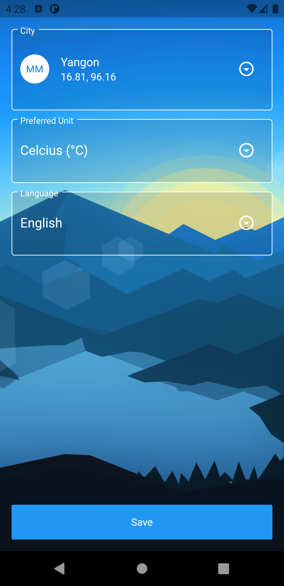

# Howdy

A compact and useful weather app written in flutter.

## Getting Started

Clone this repository in your local machine and run "flutter pub get && cd minhttp && flutter pub get". Then you are ready to go.

## Supported Locales

English
Myanmar

## Screenshots

    
